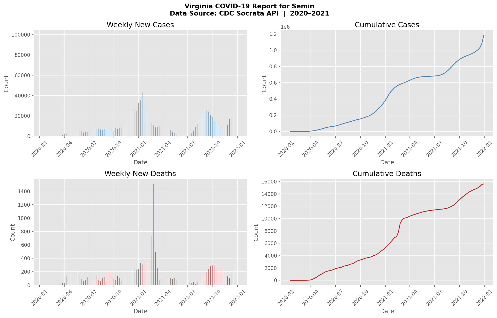

# COVID-19 Automated Data Pipeline

**Author**: Semin Seo  
**Version**: 2.0 (Automated Pipeline)

---

## Sample Output



*Virginia 2020–2021: Weekly new cases/deaths (bar) + Cumulative cases/deaths (line)*

---

## Overview

An automated COVID-19 data pipeline that fetches real-time state-level data from the **CDC Socrata Open Data API**, applies statistical analysis, and exports charts, CSV reports, and interactive maps — all in a single Python script.

> **Upgrade from v1.0**: The original notebook loaded a static CSV from a professor's GitHub. v2.0 connects to a live government API with local caching and automated report saving.

---

## Features

| Feature | Description |
|---------|-------------|
| Live CDC API | Pulls from `data.cdc.gov` Socrata Open Data API (no API key required) |
| Local Cache | Date-based cache prevents redundant API calls on same-day re-runs |
| Auto Reports | Saves PNG chart, CSV stats, and HTML map automatically |
| Bug-free Stats | 3 logic bugs from original notebook identified and corrected |
| All 50 States | Works for any U.S. state by full name input |

---

## Quick Start

```bash
# Install dependencies
pip install requests pandas geopandas matplotlib folium

# Run the pipeline
python covid_pipeline.py
```

**Example session:**
```
Hello. Please enter your name: Semin
Which state's COVID-19 data would you like?
  Enter the full state name (e.g., Virginia): Virginia

  -> [CDC API call] state=VA (2020-01-01 ~ 2021-12-31)
  ✓ [Cache saved] VA_2026-05-23.csv (103 rows)

Day 0 of COVID-19 in Virginia: March 05, 2020

Virginia — Annual Statistics
2020:
  - Total reported cases:           377,309
  - Avg weekly new cases:           7,398.2
  - Total reported deaths:            5,227
  - Avg weekly new deaths:            102.5

2021:
  - Total reported cases:         1,186,887
  - Avg weekly new cases:          15,568.8
  - Total reported deaths:           15,619
  - Avg weekly new deaths:            199.8
```

---

## Data Source

- **API**: [CDC Socrata — Weekly COVID-19 Cases and Deaths by State](https://data.cdc.gov/resource/pwn4-m3yp.json)
- **Authentication**: None (free public API)
- **Fields used**: `start_date`, `state`, `tot_cases`, `new_cases`, `tot_deaths`, `new_deaths`
- **Coverage**: Jan 2020 – Dec 2021, all 50 U.S. states + DC

---

## Project Structure

```
covid-pipeline/
├── covid_pipeline.py        # Main pipeline (single file, ~460 lines)
├── covid_cache/             # Auto-created: cached API responses
│   └── VA_2026-05-23.csv
└── covid_output/            # Auto-created: saved reports
    ├── Virginia_2026-05-23_report.png
    ├── Virginia_2026-05-23_stats.csv
    └── Virginia_2026-05-23_map.html
```

---

## Architecture

```python
DataFetcher   # CDC API call + date-based local cache
DataAnalyzer  # annual_stats() / overall_stats() / time_series()
ReportSaver   # PNG chart / stats CSV / Folium HTML map
Visualizer    # 2x2 time-series subplot OR interactive state map
```

---

## Logic Bug Fixes (from Original Notebook)

Three critical logic errors were identified and corrected in the original MIS433 notebook:

### Bug 1 — `average_daily_cases`: Cumulative value divided by days

```python
# ORIGINAL (wrong): divides cumulative total by number of days
average_daily_cases = total_cases / number_of_days  # meaningless

# FIXED: use new_cases column directly (already a per-period value)
avg_weekly_cases = yearly["new_cases"].mean()        # correct
```

### Bug 2 — `total_cases_overall`: Double-counting across years

```python
# ORIGINAL (wrong): 2020 cumulative + 2021 cumulative ≈ 2x overcount
total_cases_overall = summary_stats[2020]['total_cases'] + summary_stats[2021]['total_cases']

# FIXED: 2021 final row already includes all of 2020
total_cases_overall = summary_stats[2021]['total_cases']
```

### Bug 3 — `id_vars_deaths`: Typo in column name `'late'`

```python
# ORIGINAL (wrong): typo causes KeyError
id_vars_deaths = [..., 'late', ...]

# FIXED
id_vars_deaths = [..., 'lat', ...]   # latitude column
```

---

## Visualization Options

**Option 1 — Time-series subplots (2×2)**

Four panels: Weekly new cases, Cumulative cases, Weekly new deaths, Cumulative deaths (2020–2021)

**Option 2 — Interactive state map**

Folium marker with popup showing total cases/deaths as of Dec 31, 2021

---

## Tech Stack

`Python 3.x` · `pandas` · `requests` · `matplotlib` · `folium` · `geopandas` · `pathlib`

---

## Verified Results (Virginia)

| Metric | Value |
|--------|-------|
| First COVID case | March 05, 2020 |
| 2020 total cases | 377,309 |
| 2020 avg weekly new cases | 7,398 |
| 2021 total cases (cumulative) | 1,186,887 |
| 2021 avg weekly new cases | 15,568 |
| Overall total cases | 1,186,887 ✓ (no double-count) |
